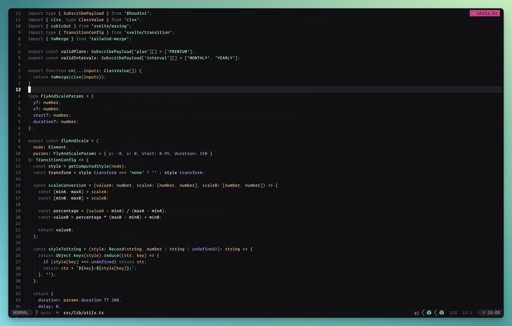

<h1 align="center" >🌌 norrsken.nvim</h1>

<p align="center"><a href="https://norrsken.dev/">Norrsken</a> colorscheme for <a href="https://neovim.io/">NEOVIM</a> written in Lua</p>



## ✔️ Requirements

- Neovim >= 0.9.2
- Treesitter (optional)

## #️ Supported Plugins

- [LSP](https://github.com/neovim/nvim-lspconfig)
- [Treesitter](https://github.com/nvim-treesitter/nvim-treesitter)
- [nvim-compe](https://github.com/hrsh7th/nvim-compe)
- [nvim-cmp](https://github.com/hrsh7th/nvim-cmp)
- [Telescope](https://github.com/nvim-telescope/telescope.nvim)
- [NvimTree](https://github.com/kyazdani42/nvim-tree.lua)
- [NeoTree](https://github.com/nvim-neo-tree/neo-tree.nvim)
- [BufferLine](https://github.com/akinsho/nvim-bufferline.lua)
- [Git Signs](https://github.com/lewis6991/gitsigns.nvim)
- [Lualine](https://github.com/hoob3rt/lualine.nvim)
- [LSPSaga](https://github.com/glepnir/lspsaga.nvim)
- [indent-blankline](https://github.com/lukas-reineke/indent-blankline.nvim)
- [nvim-ts-rainbow](https://github.com/p00f/nvim-ts-rainbow)
- [nvim-dap-ui](https://github.com/rcarriga/nvim-dap-ui)

## ⬇️ Installation

Install via package manager

```lua
-- Using Packer:
use 'webhooked/norrsken.nvim'
```

```vim
" Using Vim-Plug:
Plug 'webhooked/norrsken.nvim'
```

## 🚀 Usage

```lua
-- Lua:
vim.cmd[[colorscheme norrsken]]
```

```vim
" Vim-Script:
colorscheme norrsken
```

If you are using [`lualine`](https://github.com/hoob3rt/lualine.nvim), you can also enable the provided theme:

> Make sure to set theme as 'norrsken-nvim' as norrsken already exists in lualine built in themes

```lua
require('lualine').setup {
  options = {
    -- ...
    theme = 'norrsken-nvim'
    -- ...
  }
}
```

If you are using [LazyVim](https://github.com/LazyVim/LazyVim), you can add this to your plugins/colorscheme.lua file:

```
return {
  -- add norrsken
  { "webhooked/norrsken.nvim" },

  -- Configure LazyVim to load norrsken
  {
    "LazyVim/LazyVim",
    opts = {
      colorscheme = "norrsken",
    },
  },
}
```

## 🔧 Configuration

The configuration must be run before `colorscheme` command to take effect.
If you're using Lua:

```lua
local norrsken = require("norrsken")
norrsken.setup({
  -- customize norrsken color palette
  colors = {
      bg = "#101012",
      fg = "#F8F8F2",
      selection = "#202026",
      comment = "#707077",
      flare = "#FF999E",
      shimmer = "#FFB86C",
      glow = "#FFC799",
      aurora = "#99FFC7",
      twilight = "#C799FF",
      nebula = "#99FFC7",
      sky = "#C799FF",
      bright_red = "#FF999E",
      bright_green = "#99FFC7",
      bright_yellow = "#FFC799",
      bright_blue = "#99D1FF",
      bright_magenta = "#C799FF",
      bright_cyan = "#99FFC7",
      bright_white = "#FFFFFF",
      menu = "#101012",
      visual = "#151519",
      gutter_fg = "#202026",
      nontext = "#202026",
      white = "#B2B2B2",
      black = "#101012"
  },
  -- show the '~' characters after the end of buffers
  show_end_of_buffer = true, -- default false
  -- use transparent background
  transparent_bg = true, -- default false
  -- set custom lualine background color
  lualine_bg_color = "#101012", -- default nil
  -- set italics
  italics {
    comments = true, -- default false
    keywords = true, -- default false
  },
  -- overrides the default highlights with table see `:h synIDattr`
  overrides = {},
  -- You can use overrides as table like this
  -- overrides = {
  --   NonText = { fg = "white" }, -- set NonText fg to white
  --   NvimTreeIndentMarker = { link = "NonText" }, -- link to NonText highlight
  --   Nothing = {} -- clear highlight of Nothing
  -- },
  -- Or you can also use it like a function to get color from theme
  -- overrides = function (colors)
  --   return {
  --     NonText = { fg = colors.white }, -- set NonText fg to white of theme
  --   }
  -- end,
})
```
