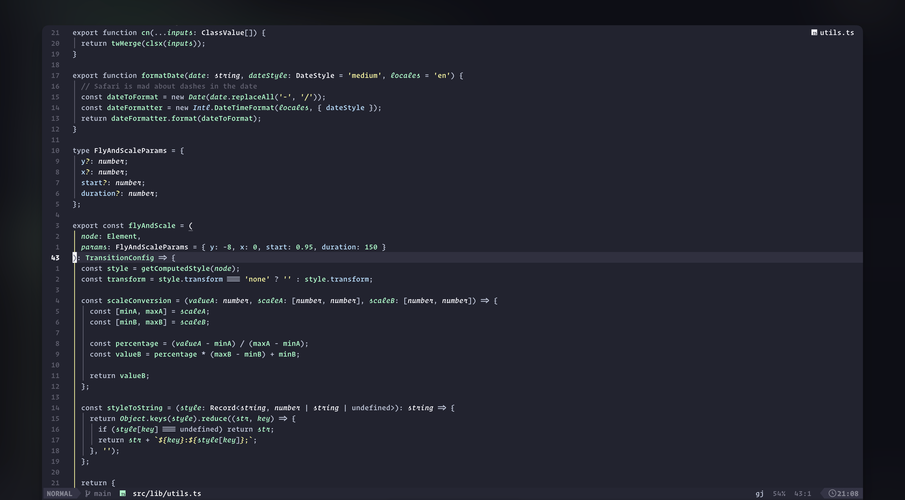

<h1 align="center" >🌌 norrsken.nvim</h1>

<p align="center"><a href="https://norrsken.dev/">Norrsken</a> colorscheme for <a href="https://neovim.io/">NEOVIM</a> written in Lua</p>



## ✔️ Requirements

- Neovim >= 0.9.2
- Treesitter (optional)

## #️ Supported Plugins

- [LSP](https://github.com/neovim/nvim-lspconfig)
- [Treesitter](https://github.com/nvim-treesitter/nvim-treesitter)
- [nvim-compe](https://github.com/hrsh7th/nvim-compe)
- [nvim-cmp](https://github.com/hrsh7th/nvim-cmp)
- [Telescope](https://github.com/nvim-telescope/telescope.nvim)
- [NvimTree](https://github.com/kyazdani42/nvim-tree.lua)
- [NeoTree](https://github.com/nvim-neo-tree/neo-tree.nvim)
- [BufferLine](https://github.com/akinsho/nvim-bufferline.lua)
- [Git Signs](https://github.com/lewis6991/gitsigns.nvim)
- [Lualine](https://github.com/hoob3rt/lualine.nvim)
- [LSPSaga](https://github.com/glepnir/lspsaga.nvim)
- [indent-blankline](https://github.com/lukas-reineke/indent-blankline.nvim)
- [nvim-ts-rainbow](https://github.com/p00f/nvim-ts-rainbow)
- [nvim-dap-ui](https://github.com/rcarriga/nvim-dap-ui)
- [Snacks](https://github.com/onur-ozkan/snacks.nvim) (Supports all UI components including Picker, Dashboard and Notifier)

## ⬇️ Installation

Install via package manager

```lua
-- Using Packer:
use 'webhooked/norrsken.nvim'
```

```vim
" Using Vim-Plug:
Plug 'webhooked/norrsken.nvim'
```

## 🚀 Usage

```lua
-- Lua:
vim.cmd[[colorscheme norrsken]]
```

```vim
" Vim-Script:
colorscheme norrsken
```

### Theme Variants

Norrsken now comes with three background variants:

```lua
-- Standard (Reykjavík variant)
vim.cmd[[colorscheme norrsken]]

-- Darker (Svalbard variant)
vim.cmd[[colorscheme norrsken-svalbard]]

-- Medium dark (Kiruna variant)
vim.cmd[[colorscheme norrsken-kiruna]]
```

```vim
" Standard (Reykjavík variant)
colorscheme norrsken

" Darker (Svalbard variant)
colorscheme norrsken-svalbard

" Medium dark (Kiruna variant)
colorscheme norrsken-kiruna
```

The theme properly updates UI components like Snacks Picker and NeoTree to match your selected variant. All background colors of floating windows and UI elements are consistently applied across variants.

If you are using [`lualine`](https://github.com/hoob3rt/lualine.nvim), you can also enable the provided theme:

> Make sure to set theme as 'norrsken-nvim' as norrsken already exists in lualine built in themes

```lua
require('lualine').setup {
  options = {
    -- ...
    theme = 'norrsken-nvim'
    -- ...
  }
}
```

If you are using [LazyVim](https://github.com/LazyVim/LazyVim), you can add this to your plugins/colorscheme.lua file:

```
return {
  -- add norrsken
  { "webhooked/norrsken.nvim" },

  -- Configure LazyVim to load norrsken
  {
    "LazyVim/LazyVim",
    opts = {
      colorscheme = "norrsken", -- or "norrsken-svalbard" or "norrsken-kiruna"
    },
  },
}
```

## 🔧 Configuration

The configuration must be run before `colorscheme` command to take effect.
If you're using Lua:

```lua
local norrsken = require("norrsken")
norrsken.setup({
  -- customize norrsken color palette
  colors = {
      bg = "#222330",
      fg = "#F7F7FD",
      selection = "#303040",
      comment = "#606070",
      flare = "#ff2e18",
      shimmer = "#AEDCFE",
      glow = "#98FFC7",
      aurora = "#F5F394",
      twilight = "#BBC4D8",
      nebula = "#98FFC7",
      sky = "#9580ff",
      bright_red = "#ff2e18",
      bright_green = "#98FFC7",
      bright_yellow = "#F5F394",
      bright_blue = "#9580ff",
      bright_magenta = "#BBC4D8",
      bright_cyan = "#F7F7FD",
      bright_white = "#FFFFFF",
      menu = "#222330",
      visual = "#303040",
      gutter_fg = "#606070",
      nontext = "#606070",
      white = "#F7F7FD",
      black = "#222330",
      
      -- Variants
      svalbard_bg = "#101117",
      svalbard_menu = "#101117",
      svalbard_black = "#101117",
      svalbard_selection = "#181922",
      svalbard_visual = "#181922",

      kiruna_bg = "#181922",
      kiruna_menu = "#181922",
      kiruna_black = "#181922",
      kiruna_selection = "#222330",
      kiruna_visual = "#222330",

      reykjavik_bg = "#222330",
      reykjavik_menu = "#222330",
      reykjavik_black = "#222330", 
      reykjavik_selection = "#303040",
      reykjavik_visual = "#303040",
  },
  -- show the '~' characters after the end of buffers
  show_end_of_buffer = true, -- default false
  -- use transparent background
  transparent_bg = true, -- default false
  -- set custom lualine background color
  lualine_bg_color = "#101012", -- default nil
  -- set italics
  italics {
    comments = false, -- default true
    keywords = false, -- default true
  },
  -- Configure different variants for light/dark background
  background = {
    light = "reykjavik", -- variant to use when vim.o.background is "light"
    dark = "svalbard",   -- variant to use when vim.o.background is "dark"
  },
  -- overrides the default highlights with table see `:h synIDattr`
  overrides = {},
  -- You can use overrides as table like this
  -- overrides = {
  --   NonText = { fg = "white" }, -- set NonText fg to white
  --   NvimTreeIndentMarker = { link = "NonText" }, -- link to NonText highlight
  --   Nothing = {} -- clear highlight of Nothing
  -- },
  -- Or you can also use it like a function to get color from theme
  -- overrides = function (colors)
  --   return {
  --     NonText = { fg = colors.white }, -- set NonText fg to white of theme
  --   }
  -- end,
})
```

### Automatic Light/Dark Mode Switching

You can configure the theme to automatically use different variants based on whether you're in light or dark mode:

```lua
-- Setup norrsken with automatic variant switching
require("norrsken").setup({
  background = {
    light = "reykjavik", -- Use reykjavik variant in light mode
    dark = "svalbard",   -- Use svalbard variant in dark mode
  },
})

-- Apply the colorscheme
vim.cmd([[colorscheme norrsken]])

-- When you switch backgrounds, the theme variant will change automatically
vim.o.background = "dark"   -- Will use svalbard variant
vim.o.background = "light"  -- Will use reykjavik variant
```

You can specify any of the variants ("svalbard", "kiruna", or "reykjavik") for either light or dark mode.
